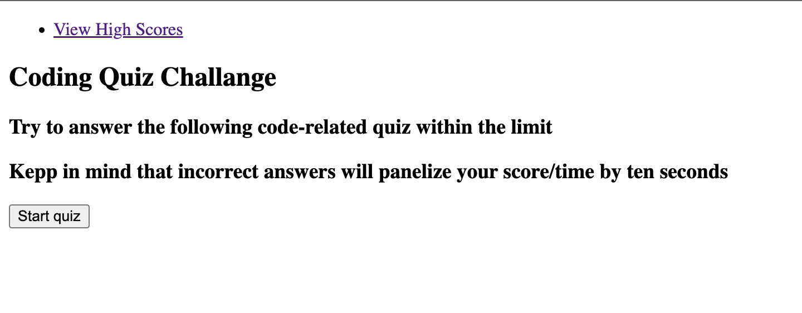
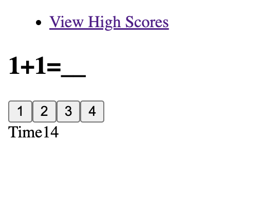
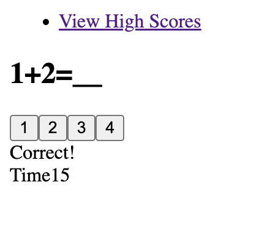
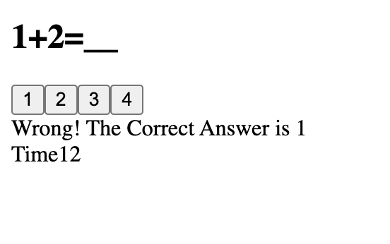
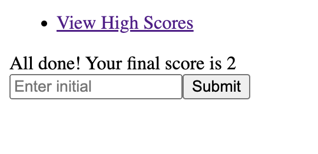

# Module 4 Web APIs Challenge: Code Quiz

## Description

- This project enables the audience to take quiz and view their quiz scores

## Usage

- Audience can select choices and answer the questions

## Images

## deployed application

[application link] (https://jennyzzhh.github.io/Module-4-Web-APIs/)
[Github link] (https://github.com/Jennyzzhh/Module-4-Web-APIs.git)